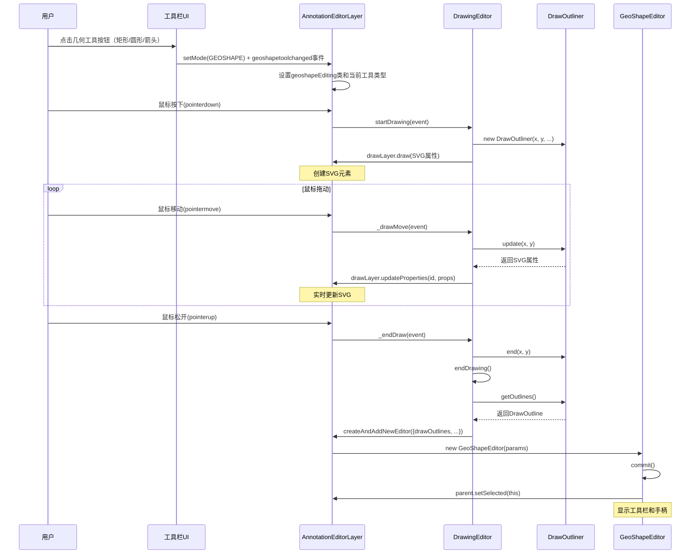

# 几何工具完整实现指南

> 本文档详细记录几何工具（矩形、圆形、箭头）的完整实现过程，包括绘制功能和交互功能。基于代码现状进行总结。

## 目录

1. [架构概览](#架构概览)
2. [核心类实现](#核心类实现)
3. [绘制流程详解](#绘制流程详解)
4. [交互功能实现](#交互功能实现)
5. [CSS样式配置](#css样式配置)
6. [参数管理系统](#参数管理系统)
7. [序列化与反序列化](#序列化与反序列化)
8. [工具切换机制](#工具切换机制)
9. [实施检查清单](#实施检查清单)

---

## 架构概览

### 类继承关系

```
AnnotationEditor (基类)
    ↓ 继承
DrawingEditor (绘图编辑器基类)
    ↓ 继承
RectangleEditor (矩形编辑器)
CircleEditor (圆形编辑器)
ArrowEditor (箭头编辑器)
```

### 核心组件

| 组件                  | 文件路径                                      | 职责                         |
| --------------------- | --------------------------------------------- | ---------------------------- |
| `RectangleEditor`     | `src/display/editor/rectangle.js`             | 矩形编辑器主类，管理生命周期 |
| `CircleEditor`        | `src/display/editor/circle.js`                | 圆形编辑器主类，管理生命周期 |
| `ArrowEditor`         | `src/display/editor/arrow.js`                 | 箭头编辑器主类，管理生命周期 |
| `RectDrawingOptions`  | `src/display/editor/rectangle.js`             | 矩形SVG属性管理              |
| `CircDrawingOptions`  | `src/display/editor/circle.js`                | 圆形SVG属性管理              |
| `ArrowDrawingOptions` | `src/display/editor/arrow.js`                 | 箭头SVG属性管理              |
| `RectDrawOutliner`    | `src/display/editor/drawers/rectangledraw.js` | 矩形实时绘制管理             |
| `CircDrawOutliner`    | `src/display/editor/drawers/circledraw.js`    | 圆形实时绘制管理             |
| `ArrowDrawOutliner`   | `src/display/editor/drawers/arrowdraw.js`     | 箭头实时绘制管理             |
| `RectDrawOutline`     | `src/display/editor/drawers/rectangledraw.js` | 矩形轮廓数据存储             |
| `CircDrawOutline`     | `src/display/editor/drawers/circledraw.js`    | 圆形轮廓数据存储             |
| `ArrowDrawOutline`    | `src/display/editor/drawers/arrowdraw.js`     | 箭头轮廓数据存储             |
| `DrawingEditor`       | `src/display/editor/draw.js`                  | 通用绘图逻辑                 |

---

## 核心类实现

### 1. RectangleEditor 类

**位置**: `src/display/editor/rectangle.js`

#### 1.1 类定义与配置

```javascript
class RectangleEditor extends DrawingEditor {
  static _type = "rectangle"; // 编辑器类型标识
  static _editorType = AnnotationEditorType.GEOSHAPE; // 注解类型（103）
  static _defaultDrawingOptions = null; // 默认绘图选项

  constructor(params) {
    super({ ...params, name: "rectangleEditor" });
    this._willKeepAspectRatio = false; // 不保持宽高比（允许8个手柄）
    this.defaultL10nId = "pdfjs-editor-rectangle-editor";
  }
}
```

**关键属性说明**：

- `_type = "rectangle"`: 用于CSS类名和DOM标识
- `_editorType = GEOSHAPE`: PDF注解类型，值为103
- `_willKeepAspectRatio = false`: 控制调整手柄数量
  - `false` → 8个手柄（4角 + 4边）
  - `true` → 4个手柄（仅4角）

#### 1.2 参数类型映射

```javascript
static get typesMap() {
  return shadow(
    this,
    "typesMap",
    new Map([
      [AnnotationEditorParamsType.RECTANGLE_THICKNESS, "stroke-width"],
      [AnnotationEditorParamsType.RECTANGLE_COLOR, "stroke"],
      [AnnotationEditorParamsType.RECTANGLE_OPACITY, "stroke-opacity"],
    ])
  );
}
```

**用途**: 将UI参数类型（51, 52, 53）映射到SVG属性名

#### 1.3 SVG元素类型

矩形工具使用 `<rect>` SVG元素进行绘制。

---

### 2. CircleEditor 类

**位置**: `src/display/editor/circle.js`

#### 2.1 类定义与配置

```javascript
class CircleEditor extends DrawingEditor {
  static _type = "circle"; // 编辑器类型标识
  static _editorType = AnnotationEditorType.GEOSHAPE; // 注解类型（103）
  static _defaultDrawingOptions = null; // 默认绘图选项

  constructor(params) {
    super({ ...params, name: "circleEditor" });
    this._willKeepAspectRatio = false; // 允许椭圆（8个手柄）
    this.defaultL10nId = "pdfjs-editor-circle-editor";
  }
}
```

**关键属性说明**：

- `_type = "circle"`: 用于CSS类名和DOM标识
- `_willKeepAspectRatio = false`: 允许绘制椭圆，支持8个调整手柄

#### 2.2 参数类型映射

```javascript
static get typesMap() {
  return shadow(
    this,
    "typesMap",
    new Map([
      [AnnotationEditorParamsType.CIRCLE_THICKNESS, "stroke-width"],
      [AnnotationEditorParamsType.CIRCLE_COLOR, "stroke"],
      [AnnotationEditorParamsType.CIRCLE_OPACITY, "stroke-opacity"],
    ])
  );
}
```

#### 2.3 SVG元素类型

圆形工具使用 `<ellipse>` SVG元素进行绘制。

#### 2.4 坐标存储格式

圆形工具使用中心点+半径的格式存储：

- `ellipseData`: `[cx, cy, rx, ry]` - 中心点坐标和X/Y半径（归一化坐标）

---

### 3. ArrowEditor 类

**位置**: `src/display/editor/arrow.js`

#### 3.1 类定义与配置

```javascript
class ArrowEditor extends DrawingEditor {
  static _type = "arrow"; // 编辑器类型标识
  static _editorType = AnnotationEditorType.GEOSHAPE; // 注解类型（103）
  static _defaultDrawingOptions = null; // 默认绘图选项

  constructor(params) {
    super({ ...params, name: "arrowEditor" });
    this._willKeepAspectRatio = false; // 允许8个手柄
    this.defaultL10nId = "pdfjs-editor-arrow-editor";
  }
}
```

**关键属性说明**：

- `_type = "arrow"`: 用于CSS类名和DOM标识
- `_willKeepAspectRatio = false`: 允许8个调整手柄

#### 3.2 参数类型映射

```javascript
static get typesMap() {
  return shadow(
    this,
    "typesMap",
    new Map([
      [AnnotationEditorParamsType.ARROW_THICKNESS, "stroke-width"],
      [AnnotationEditorParamsType.ARROW_COLOR, "stroke"],
      [AnnotationEditorParamsType.ARROW_OPACITY, "stroke-opacity"],
      [AnnotationEditorParamsType.ARROW_HEAD_SIZE, "arrow-head-size"],
    ])
  );
}
```

**特殊参数**：

- `ARROW_HEAD_SIZE`: 箭头头部大小（归一化值，默认0.02）

#### 3.3 SVG元素类型

箭头工具使用 `<line>` + `<path>` SVG元素进行绘制：

- `<line>`: 箭头主体线条
- `<path>`: 箭头头部（三角形）

#### 3.4 坐标存储格式

箭头工具使用起点+终点+头部大小的格式存储：

- `arrowData`: `[startX, startY, endX, endY, headSize]` - 起点、终点坐标和头部大小（归一化坐标）

#### 3.5 箭头头部计算

```javascript
#calculateArrowHead() {
  const dx = this.#endX - this.#startX;
  const dy = this.#endY - this.#startY;
  const angle = Math.atan2(dy, dx);
  const headLength = this.#headSize;
  const headAngle = Math.PI / 6; // 30度

  // 计算箭头头部的两个翼点
  const wing1X = this.#endX - headLength * Math.cos(angle - headAngle);
  const wing1Y = this.#endY - headLength * Math.sin(angle - headAngle);
  const wing2X = this.#endX - headLength * Math.cos(angle + headAngle);
  const wing2Y = this.#endY - headLength * Math.sin(angle + headAngle);

  return { wing1X, wing1Y, wing2X, wing2Y };
}
```

---

### 4. DrawingOptions 子类

#### 4.1 RectDrawingOptions

```javascript
class RectDrawingOptions extends DrawingOptions {
  constructor(viewerParameters) {
    super();
    this._viewParameters = viewerParameters;

    super.updateProperties({
      fill: "none", // 无填充
      stroke: "#ff0000", // 默认红色
      "stroke-opacity": 1, // 不透明度
      "stroke-width": 1, // 粗细
      "stroke-linecap": "square", // 方形端点
      "stroke-linejoin": "miter", // 斜接连接
      "stroke-miterlimit": 10, // 斜接限制
    });
  }
}
```

#### 4.2 CircDrawingOptions

```javascript
class CircDrawingOptions extends DrawingOptions {
  constructor(viewerParameters) {
    super();
    this._viewParameters = viewerParameters;

    super.updateProperties({
      fill: "none", // 无填充
      stroke: "#ff0000", // 默认红色
      "stroke-opacity": 1,
      "stroke-width": 1,
      "stroke-linecap": "round", // 圆形端点
      "stroke-linejoin": "round", // 圆形连接
    });
  }
}
```

#### 4.3 ArrowDrawingOptions

```javascript
class ArrowDrawingOptions extends DrawingOptions {
  constructor(viewerParameters) {
    super();
    this._viewParameters = viewerParameters;

    super.updateProperties({
      fill: "#ff0000", // 箭头头部填充
      stroke: "#ff0000", // 默认红色
      "stroke-opacity": 1,
      "stroke-width": 1,
      "stroke-linecap": "round",
      "stroke-linejoin": "round",
      "arrow-head-size": 0.02, // 箭头头部大小
    });
  }

  updateProperty(name, value) {
    super.updateProperty(name, value);
    // 保持填充颜色与描边颜色同步
    if (name === "stroke") {
      super.updateProperty("fill", value);
    }
  }
}
```

**关键方法**：

- `updateSVGProperty()`: 处理缩放时的属性更新（stroke-width需要乘以realScale）
- `clone()`: 为每个编辑器实例创建独立副本

---

### 5. DrawOutliner 类

#### 5.1 RectDrawOutliner

**职责**: 管理矩形实时绘制过程（鼠标拖动时）

```javascript
class RectDrawOutliner {
  #startX; // 起始点X（归一化坐标[0,1]）
  #startY; // 起始点Y
  #endX; // 结束点X
  #endY; // 结束点Y
  #parentWidth; // 父容器宽度
  #parentHeight; // 父容器高度
  #rotation; // 旋转角度
  #thickness; // 线条粗细

  update(x, y) {
    [this.#endX, this.#endY] = this.#normalizePoint(x, y);
    return {
      rect: this.#getCurrentRectSVGProperties(),
    };
  }

  #normalizeRect() {
    let x = this.#startX;
    let y = this.#startY;
    let width = this.#endX - this.#startX;
    let height = this.#endY - this.#startY;

    // 处理从右下往左上拖动的情况
    if (width < 0) {
      x = this.#endX;
      width = -width;
    }

    if (height < 0) {
      y = this.#endY;
      height = -height;
    }

    return [x, y, width, height];
  }
}
```

#### 5.2 CircDrawOutliner

**职责**: 管理圆形实时绘制过程

```javascript
class CircDrawOutliner {
  #centerX; // 中心点X
  #centerY; // 中心点Y
  #radiusX; // X半径
  #radiusY; // Y半径

  update(x, y) {
    const [endX, endY] = this.#normalizePoint(x, y);

    // 从中心点到当前点计算半径
    this.#radiusX = Math.abs(endX - this.#centerX);
    this.#radiusY = Math.abs(endY - this.#centerY);

    return {
      ellipse: this.#getCurrentEllipseSVGProperties(),
    };
  }
}
```

**特点**: 使用中心点+半径模式，第一个点击点作为中心，拖动距离作为半径。

#### 5.3 ArrowDrawOutliner

**职责**: 管理箭头实时绘制过程

```javascript
class ArrowDrawOutliner {
  #startX; // 起点X
  #startY; // 起点Y
  #endX; // 终点X
  #endY; // 终点Y
  #headSize = 0.02; // 箭头头部大小

  update(x, y) {
    [this.#endX, this.#endY] = this.#normalizePoint(x, y);
    return this.#getCurrentArrowSVGProperties();
  }

  #getCurrentArrowSVGProperties() {
    const { wing1X, wing1Y, wing2X, wing2Y } = this.#calculateArrowHead();

    return {
      line: {
        x1: Outline.svgRound(this.#startX),
        y1: Outline.svgRound(this.#startY),
        x2: Outline.svgRound(this.#endX),
        y2: Outline.svgRound(this.#endY),
      },
      path: {
        d: `M${Outline.svgRound(this.#endX)} ${Outline.svgRound(this.#endY)}L${Outline.svgRound(wing1X)} ${Outline.svgRound(wing1Y)}L${Outline.svgRound(wing2X)} ${Outline.svgRound(wing2Y)}Z`,
      },
    };
  }
}
```

**特点**: 需要实时计算箭头头部位置，使用三角函数计算两个翼点。

---

### 6. DrawOutline 类

#### 6.1 RectDrawOutline

**职责**: 存储完成的矩形轮廓数据

```javascript
class RectDrawOutline extends Outline {
  #bbox; // 边界框 [x, y, width, height]
  #rect; // 矩形数据 Float32Array [x, y, width, height]

  build(
    rect,
    parentWidth,
    parentHeight,
    parentScale,
    rotation,
    thickness,
    innerMargin
  ) {
    this.#rect = new Float32Array(rect);
    // ... 存储其他属性
    this.#computeBbox(); // 计算边界框
  }
}
```

#### 6.2 CircDrawOutline

**职责**: 存储完成的圆形轮廓数据

```javascript
class CircDrawOutline extends Outline {
  #bbox; // 边界框
  #ellipse; // 椭圆数据 Float32Array [cx, cy, rx, ry]

  toSVGPath() {
    const [cx, cy, rx, ry] = this.#ellipse;
    // 使用贝塞尔曲线近似椭圆
    const kappa = 0.5522848;
    // ... 生成路径
  }
}
```

**特点**: 使用贝塞尔曲线（4段）近似椭圆，因为SVG没有原生椭圆路径。

#### 6.3 ArrowDrawOutline

**职责**: 存储完成的箭头轮廓数据

```javascript
class ArrowDrawOutline extends Outline {
  #bbox; // 边界框
  #arrow; // 箭头数据 Float32Array [startX, startY, endX, endY, headSize]

  #computeBbox() {
    const [startX, startY, endX, endY, headSize] = this.#arrow;
    const { wing1X, wing1Y, wing2X, wing2Y } = this.#calculateArrowHead();

    // 计算所有点（起点、终点、箭头头部两个翼点）的边界框
    const minX = Math.min(startX, endX, wing1X, wing2X);
    const minY = Math.min(startY, endY, wing1Y, wing2Y);
    const maxX = Math.max(startX, endX, wing1X, wing2X);
    const maxY = Math.max(startY, endY, wing1Y, wing2Y);
    // ...
  }
}
```

**特点**: 边界框需要包含箭头头部的两个翼点。

---

## 绘制流程详解

### 完整流程图



### 阶段详解

#### 阶段1：初始化绘制

**触发**: 用户在PDF页面上按下鼠标

**调用链**:

```
AnnotationEditorLayer.pointerdown
  → startDrawingSession
    → DrawingEditor.startDrawing
      → createDrawerInstance
        → new DrawOutliner(x, y, ...)
      → parent.drawLayer.draw(SVGProperties)
```

**关键代码**（DrawingEditor.startDrawing）:

```javascript
static startDrawing(parent, uiManager, isLTR, event) {
  // 获取绘制起点
  const { offsetX: x, offsetY: y } = event;
  const { parentWidth, parentHeight, rotation } = parent;

  // 创建绘制器实例（根据当前工具类型）
  DrawingEditor.#currentDraw = this.createDrawerInstance(
    x,
    y,
    parentWidth,
    parentHeight,
    rotation
  );

  // 获取默认绘图选项
  DrawingEditor.#currentDrawingOptions = this.getDefaultDrawingOptions();

  // 在SVG层绘制
  ({ id: this._currentDrawId } = parent.drawLayer.draw(
    this._mergeSVGProperties(
      DrawingEditor.#currentDrawingOptions.toSVGProperties(),
      DrawingEditor.#currentDraw.defaultSVGProperties
    )
  ));
}
```

#### 阶段2：实时更新

**触发**: 用户拖动鼠标

**调用链**:

```
window.pointermove
  → DrawingEditor._drawMove
    → DrawOutliner.update
      → parent.drawLayer.updateProperties
```

**关键代码**:

```javascript
static _drawMove(event) {
  const { offsetX: x, offsetY: y } = event;

  // 更新绘制器状态
  const updates = DrawingEditor.#currentDraw.add(x, y);

  // 更新SVG显示
  this._currentParent.drawLayer.updateProperties(
    this._currentDrawId,
    updates
  );
}
```

**各工具更新差异**：

- **矩形**: 更新 `rect` 属性（x, y, width, height）
- **圆形**: 更新 `ellipse` 属性（cx, cy, rx, ry）
- **箭头**: 更新 `line` 和 `path` 属性（起点、终点、箭头头部）

#### 阶段3：完成绘制

**触发**: 用户松开鼠标

**调用链**:

```
window.pointerup
  → DrawingEditor._endDraw
    → DrawingEditor.endDrawing
      → DrawOutliner.getOutlines
        → parent.createAndAddNewEditor
          → new GeoShapeEditor
            → commit
              → parent.setSelected(this)
```

**关键代码**（DrawingEditor.endDrawing）:

```javascript
static endDrawing(isAborted) {
  const parent = this._currentParent;

  if (!DrawingEditor.#currentDraw.isEmpty()) {
    const { pageDimensions, scale } = parent;

    // 创建编辑器实例
    const editor = parent.createAndAddNewEditor(
      { offsetX: 0, offsetY: 0 },
      false,
      {
        drawId: this._currentDrawId,
        drawOutlines: DrawingEditor.#currentDraw.getOutlines(
          pageWidth * scale,
          pageHeight * scale,
          scale,
          this._INNER_MARGIN
        ),
        drawingOptions: DrawingEditor.#currentDrawingOptions,
        mustBeCommitted: !isAborted,
      }
    );

    this._cleanup(true);
    return editor;
  }

  // 图形太小，清理
  parent.drawLayer.remove(this._currentDrawId);
  this._cleanup(true);
  return null;
}
```

---

## 交互功能实现

### 1. 选中状态

**实现**: 继承自 `AnnotationEditor.select()`

```javascript
select() {
  this.isSelected = true;
  this.makeResizable();                    // 显示调整手柄
  this.div?.classList.add("selectedEditor"); // 添加蓝色边框

  if (!this._editToolbar) {
    this.addEditToolbar().then(() => {
      if (this.div?.classList.contains("selectedEditor")) {
        this._editToolbar?.show();          // 显示工具栏
      }
    });
    return;
  }

  this._editToolbar?.show();
}
```

**CSS效果**:

```css
.annotationEditorLayer
  :is(.rectangleEditor, .circleEditor, .arrowEditor).selectedEditor {
  border: var(--focus-outline); /* 蓝色边框 */
  outline: var(--focus-outline-around);
}
```

### 2. 调整手柄

**创建**: `AnnotationEditor.makeResizable()` → `#createResizers()`

所有几何工具都使用8个调整手柄（4角 + 4边），因为 `_willKeepAspectRatio = false`。

```javascript
#createResizers() {
  const resizers = (this.#resizersDiv = document.createElement("div"));
  resizers.classList.add("resizers");

  // 8个手柄位置
  const classes = [
    "topLeft", "topMiddle", "topRight",
    "middleRight",
    "bottomRight", "bottomMiddle",
    "bottomLeft", "middleLeft",
  ];

  for (const name of classes) {
    const div = document.createElement("div");
    div.classList.add("resizer", name);
    div.setAttribute("data-resizer-name", name);
    div.tabIndex = -1;
    resizers.append(div);
  }

  this.div.prepend(resizers);
}
```

### 3. 工具栏

**创建**: `AnnotationEditor.addEditToolbar()`

所有几何工具都提供颜色选择器：

```javascript
get toolbarButtons() {
  this._colorPicker ||= new BasicColorPicker(this);
  return [["colorPicker", this._colorPicker]];
}
```

---

## CSS样式配置

### 关键CSS选择器

**文件**: `web/annotation_editor_layer_builder.css`

#### 1. 编辑器基础样式

```css
.annotationEditorLayer
  :is(
    .freeTextEditor,
    .inkEditor,
    .stampEditor,
    .signatureEditor,
    .rectangleEditor,
    .circleEditor,
    .arrowEditor  /* ⚠️ 必须包含所有几何工具 */
  ) {
  position: absolute;
  background: transparent;
  z-index: 1;
  transform-origin: 0 0;
  cursor: auto;
  max-width: 100%;
  max-height: 100%;
  border: var(--unfocus-outline);

  &.draggable.selectedEditor {
    cursor: move;
  }

  &.selectedEditor {
    border: var(--focus-outline);
    outline: var(--focus-outline-around);
  }

  &:hover:not(.selectedEditor) {
    border: var(--hover-outline);
    outline: var(--hover-outline-around);
  }
}
```

#### 2. 工具栏样式

```css
.annotationEditorLayer
  :is(
    .freeTextEditor,
    .inkEditor,
    .stampEditor,
    .highlightEditor,
    .signatureEditor,
    .rectangleEditor,
    .circleEditor,
    .arrowEditor  /* ⚠️ 必须包含所有几何工具 */
  ),
.textLayer {
  .editToolbar {
    /* ... 工具栏样式 ... */
  }
}
```

#### 3. 调整手柄样式

```css
.annotationEditorLayer {
  :is(
    .freeTextEditor,
    .inkEditor,
    .stampEditor,
    .signatureEditor,
    .rectangleEditor,
    .circleEditor,
    .arrowEditor  /* ⚠️ 必须包含所有几何工具 */
  ) {
    & > .resizers {
      position: absolute;
      inset: 0;
      z-index: 1;

      & > .resizer {
        width: var(--resizer-size);
        height: var(--resizer-size);
        background: content-box var(--resizer-bg-color);
        border: var(--focus-outline-around);
        border-radius: 2px;
        position: absolute;

        /* 8个手柄的具体位置 */
        &.topLeft {
          top: var(--resizer-shift);
          left: var(--resizer-shift);
        }
        &.topMiddle {
          top: var(--resizer-shift);
          left: calc(50% + var(--resizer-shift));
        }
        &.topRight {
          top: var(--resizer-shift);
          right: var(--resizer-shift);
        }
        &.middleRight {
          top: calc(50% + var(--resizer-shift));
          right: var(--resizer-shift);
        }
        &.bottomRight {
          bottom: var(--resizer-shift);
          right: var(--resizer-shift);
        }
        &.bottomMiddle {
          bottom: var(--resizer-shift);
          left: calc(50% + var(--resizer-shift));
        }
        &.bottomLeft {
          bottom: var(--resizer-shift);
          left: var(--resizer-shift);
        }
        &.middleLeft {
          top: calc(50% + var(--resizer-shift));
          left: var(--resizer-shift);
        }
      }
    }
  }
}
```

#### 4. 绘制模式光标

```css
.annotationEditorLayer.geoshapeEditing {
  cursor: var(--editorGeoShape-rect-cursor);
}

.annotationEditorLayer.geoshapeRectEditing {
  cursor: var(--editorGeoShape-rect-cursor);
}

.annotationEditorLayer.geoshapeCircEditing {
  cursor: var(--editorGeoShape-circ-cursor);
}

.annotationEditorLayer.geoshapeArrowEditing {
  cursor: var(--editorGeoShape-arrow-cursor);
}
```

---

## 参数管理系统

### 参数类型定义

**文件**: `src/shared/util.js`

```javascript
const AnnotationEditorParamsType = {
  // ... 其他参数类型
  RECTANGLE_COLOR: 51,
  RECTANGLE_THICKNESS: 52,
  RECTANGLE_OPACITY: 53,
  CIRCLE_COLOR: 54,
  CIRCLE_THICKNESS: 55,
  CIRCLE_OPACITY: 56,
  ARROW_COLOR: 57,
  ARROW_THICKNESS: 58,
  ARROW_OPACITY: 59,
  ARROW_HEAD_SIZE: 60,
};
```

### 参数面板配置

**HTML**: `web/viewer.html`（几何工具面板）

所有几何工具共享同一个参数面板，通过 `geoshapetoolchanged` 事件切换参数类型：

```html
<div
  id="editorGeoShapeParamsToolbar"
  class="editorParamsToolbar hidden doorHangerRight"
>
  <div class="editorParamsToolbarContainer">
    <div class="editorParamsSetter">
      <label
        for="editorGeoShapeColor"
        class="editorParamsLabel"
        data-l10n-id="pdfjs-editor-geoshape-color-label"
        >Color</label
      >
      <input
        type="color"
        id="editorGeoShapeColor"
        class="editorParamsColor"
        tabindex="110"
      />
    </div>
    <div class="editorParamsSetter">
      <label
        for="editorGeoShapeThickness"
        class="editorParamsLabel"
        data-l10n-id="pdfjs-editor-geoshape-thickness-label"
        >Thickness</label
      >
      <input
        type="range"
        id="editorGeoShapeThickness"
        class="editorParamsSlider"
        value="1"
        min="1"
        max="12"
        step="1"
        tabindex="111"
      />
    </div>
    <div class="editorParamsSetter">
      <label
        for="editorGeoShapeOpacity"
        class="editorParamsLabel"
        data-l10n-id="pdfjs-editor-geoshape-opacity-label"
        >Opacity</label
      >
      <input
        type="range"
        id="editorGeoShapeOpacity"
        class="editorParamsSlider"
        value="100"
        min="1"
        max="100"
        step="1"
        tabindex="112"
      />
    </div>
  </div>
</div>
```

### 参数事件流

```
UI输入变化
  ↓
AnnotationEditorParams.#dispatchEvent
  ↓ 派发 "annotationeditorparamschanged"
AnnotationEditorUIManager.#addEditorParamsListener
  ↓
AnnotationEditorUIManager.updateParams
  ↓
GeoShapeEditor.updateDefaultParams (静态方法，更新默认值)
或
GeoShapeEditor.updateParams (实例方法，更新当前编辑器)
  ↓
DrawLayer.updateProperties
  ↓
SVG元素更新
```

**代码示例**（AnnotationEditorParams）:

```javascript
#bindListeners({
  editorGeoShapeColor: (event, value) => {
    // 根据当前工具类型派发对应参数
    const paramType = this.#getCurrentGeoShapeParamType("COLOR");
    this.#dispatchEvent(paramType, value);
  },
  editorGeoShapeThickness: (event, value) => {
    const paramType = this.#getCurrentGeoShapeParamType("THICKNESS");
    this.#dispatchEvent(paramType, value);
  },
  editorGeoShapeOpacity: (event, value) => {
    const paramType = this.#getCurrentGeoShapeParamType("OPACITY");
    this.#dispatchEvent(paramType, value / 100);
  },
});

#getCurrentGeoShapeParamType(suffix) {
  const prefix = this.#currentGeoShapeType === "geoshapeRect" ? "RECTANGLE"
    : this.#currentGeoShapeType === "geoshapeCirc" ? "CIRCLE"
    : "ARROW";
  return AnnotationEditorParamsType[`${prefix}_${suffix}`];
}
```

---

## 序列化与反序列化

### 序列化（保存到PDF）

#### 矩形工具

```javascript
serialize(isForCopying = false) {
  if (this.isEmpty()) {
    return null;
  }

  if (this.deleted) {
    return this.serializeDeleted();
  }

  // 获取矩形坐标数据
  const { rect, rectData } = this.serializeDraw(isForCopying);

  // 获取绘图属性
  const {
    _drawingOptions: {
      stroke,
      "stroke-opacity": opacity,
      "stroke-width": thickness,
    },
  } = this;

  // 序列化数据
  const serialized = Object.assign(super.serialize(isForCopying), {
    color: AnnotationEditor._colorManager.convert(stroke),
    opacity,
    thickness,
    rect,        // PDF坐标系的矩形 [x1, y1, x2, y2]
    rectData,    // 归一化坐标 [x, y, width, height]
  });

  this.addComment(serialized);
  // ...
  return serialized;
}
```

#### 圆形工具

```javascript
serialize(isForCopying = false) {
  // ...
  const { rect, ellipseData } = this.serializeDraw(isForCopying);
  // ...
  const serialized = Object.assign(super.serialize(isForCopying), {
    color: AnnotationEditor._colorManager.convert(stroke),
    opacity,
    thickness,
    rect,
    ellipseData,  // 归一化坐标 [cx, cy, rx, ry]
  });
  // ...
}
```

#### 箭头工具

```javascript
serialize(isForCopying = false) {
  // ...
  const { rect, arrowData } = this.serializeDraw(isForCopying);
  // ...
  const serialized = Object.assign(super.serialize(isForCopying), {
    color: AnnotationEditor._colorManager.convert(stroke),
    opacity,
    thickness,
    rect,
    arrowData,  // 归一化坐标 [startX, startY, endX, endY, headSize]
  });
  // ...
}
```

### 反序列化（从PDF加载）

所有几何工具都从 `SquareAnnotationElement` 反序列化（PDF使用Square注解类型存储几何图形）：

```javascript
static async deserialize(data, parent, uiManager) {
  let initialData = null;

  if (data instanceof SquareAnnotationElement) {
    const {
      data: {
        rect,
        rotation,
        id,
        color,
        opacity,
        borderStyle: { rawWidth: thickness },
        popupRef,
        richText,
        contentsObj,
        creationDate,
        modificationDate,
      },
      parent: {
        page: { pageNumber },
      },
    } = data;

    // 转换为工具特定的数据格式
    // 矩形: rectData = [x, y, width, height]
    // 圆形: ellipseData = [cx, cy, rx, ry]
    // 箭头: arrowData = [startX, startY, endX, endY, headSize]

    initialData = data = {
      annotationType: AnnotationEditorType.GEOSHAPE,
      color: Array.from(color),
      thickness,
      opacity,
      rect: rect.slice(0),
      // 工具特定的数据字段
      pageIndex: pageNumber - 1,
      rotation,
      annotationElementId: id,
      id,
      deleted: false,
      popupRef,
      richText,
      comment: contentsObj?.str || null,
      creationDate,
      modificationDate,
    };
  }

  const editor = await super.deserialize(data, parent, uiManager);
  editor._initialData = initialData;

  if (data.comment) {
    editor.setCommentData(data);
  }

  return editor;
}
```

---

## 工具切换机制

### 工具注册

**文件**: `src/display/editor/annotation_editor_layer.js`

```javascript
static #editorTypes = new Map(
  [
    FreeTextEditor,
    InkEditor,
    RectangleEditor, // GEOSHAPE在map中由RectangleEditor代表
    StampEditor,
    HighlightEditor,
    SignatureEditor,
  ].map(type => [type._editorType, type])
);

// 额外的GEOSHAPE编辑器，共享相同的_editorType
static #geoShapeEditors = [CircleEditor, ArrowEditor];
```

### 工具切换事件

**文件**: `web/toolbar.js`

```javascript
// 为几何图标按钮添加点击事件
geoShapeButtons.forEach((button, index) => {
  button.addEventListener("click", event => {
    event.stopPropagation();

    // 移除所有按钮的toggled类
    geoShapeButtons.forEach(btn => btn.classList.remove("toggled"));
    button.classList.add("toggled");

    // 设置当前几何工具类型
    let shapeType = "geoshape";
    if (button === options.editorGeoShapeRect) {
      shapeType = "geoshapeRect";
    } else if (button === options.editorGeoShapeCirc) {
      shapeType = "geoshapeCirc";
    } else if (button === options.editorGeoShapeArrow) {
      shapeType = "geoshapeArrow";
    }

    // 触发几何工具类型变化事件
    this.eventBus.dispatch("geoshapetoolchanged", {
      source: this,
      shapeType,
    });
  });
});
```

### 工具类型判断

**文件**: `src/display/editor/annotation_editor_layer.js`

```javascript
#handleGeoShapeToolChange(shapeType) {
  this.#currentGeoShapeType = shapeType;

  // 更新CSS类
  const classList = this.div.classList;
  classList.toggle("geoshapeRectEditing", shapeType === "geoshapeRect");
  classList.toggle("geoshapeCircEditing", shapeType === "geoshapeCirc");
  classList.toggle("geoshapeArrowEditing", shapeType === "geoshapeArrow");
}

#getEditorType(mode) {
  if (mode === AnnotationEditorType.GEOSHAPE) {
    // 根据当前工具类型返回对应的编辑器类
    switch (this.#currentGeoShapeType) {
      case "geoshapeRect":
        return RectangleEditor;
      case "geoshapeCirc":
        return CircleEditor;
      case "geoshapeArrow":
        return ArrowEditor;
      default:
        return null;
    }
  }

  return AnnotationEditorLayer.#editorTypes.get(mode);
}
```

---

## 实施检查清单

### JavaScript代码

#### 矩形工具

- [x] 创建 `RectangleEditor` 类，继承自 `DrawingEditor`
- [x] 定义 `_type = "rectangle"` 和 `_editorType = GEOSHAPE`
- [x] 实现 `RectDrawingOptions` 类
- [x] 实现 `RectDrawOutliner` 类（实时绘制）
- [x] 实现 `RectDrawOutline` 类（轮廓数据）
- [x] 定义 `typesMap`（参数映射）
- [x] 实现 `toolbarButtons` getter
- [x] 实现 `serialize` 和 `deserialize`
- [x] 实现 `createDrawerInstance`
- [x] 实现 `getDefaultDrawingOptions`

#### 圆形工具

- [x] 创建 `CircleEditor` 类，继承自 `DrawingEditor`
- [x] 定义 `_type = "circle"` 和 `_editorType = GEOSHAPE`
- [x] 实现 `CircDrawingOptions` 类
- [x] 实现 `CircDrawOutliner` 类（实时绘制）
- [x] 实现 `CircDrawOutline` 类（轮廓数据）
- [x] 定义 `typesMap`（参数映射）
- [x] 实现 `toolbarButtons` getter
- [x] 实现 `serialize` 和 `deserialize`
- [x] 实现 `createDrawerInstance`
- [x] 实现 `getDefaultDrawingOptions`

#### 箭头工具

- [x] 创建 `ArrowEditor` 类，继承自 `DrawingEditor`
- [x] 定义 `_type = "arrow"` 和 `_editorType = GEOSHAPE`
- [x] 实现 `ArrowDrawingOptions` 类
- [x] 实现 `ArrowDrawOutliner` 类（实时绘制）
- [x] 实现 `ArrowDrawOutline` 类（轮廓数据）
- [x] 定义 `typesMap`（参数映射，包含ARROW_HEAD_SIZE）
- [x] 实现 `toolbarButtons` getter
- [x] 实现 `serialize` 和 `deserialize`
- [x] 实现 `createDrawerInstance`
- [x] 实现 `getDefaultDrawingOptions`

### CSS样式

- [x] 将所有编辑器类名添加到基础样式选择器
- [x] 将所有编辑器类名添加到工具栏样式选择器 ⚠️ **重要**
- [x] 将所有编辑器类名添加到调整手柄样式选择器 ⚠️ **重要**
- [x] 定义绘制模式光标样式（geoshapeRectEditing, geoshapeCircEditing, geoshapeArrowEditing）
- [x] 测试选中、悬停、禁用等状态

### 参数系统

- [x] 在 `util.js` 中定义参数类型常量（RECTANGLE*\*, CIRCLE*\_, ARROW\_\_）
- [x] 在 `viewer.html` 中添加参数面板HTML
- [x] 在 `annotation_editor_params.js` 中绑定事件监听
- [x] 实现 `updateDefaultParams` 静态方法
- [x] 实现 `updateParams` 实例方法
- [x] 实现工具切换时的参数类型切换逻辑

### 工具切换机制

- [x] 在 `annotation_editor_layer.js` 中注册所有几何工具编辑器
- [x] 实现 `geoshapetoolchanged` 事件监听
- [x] 实现 `#handleGeoShapeToolChange` 方法
- [x] 实现 `#getEditorType` 方法，根据工具类型返回对应编辑器类
- [x] 在 `toolbar.js` 中实现工具按钮点击事件

### 本地化

- [x] 颜色选择器l10n键（`BasicColorPicker.#l10nColor`）
- [x] 删除按钮l10n键（`EditorToolbar.#l10nRemove`）
- [x] 编辑器标签l10n键（`defaultL10nId`）
- [x] 在 `l10n/en-US/viewer.ftl` 添加英文翻译
- [x] 在 `l10n/zh-CN/viewer.ftl` 添加中文翻译

### 测试验证

#### 矩形工具

- [x] 绘制工具是否正常（拖动创建）
- [x] 矩形是否可以选中
- [x] 蓝色边框是否显示
- [x] 8个调整手柄是否显示且可用
- [x] 工具栏是否在正确位置（右下角外侧）
- [x] 工具栏是否包含所有按钮（颜色、批注、删除）
- [x] 颜色选择器是否工作
- [x] 参数面板是否影响新绘制的图形
- [x] 拖动移动是否正常
- [x] 调整大小是否正常
- [x] 旋转是否正常
- [x] 删除是否正常
- [x] 序列化和反序列化是否正常
- [x] 撤销/重做是否正常

#### 圆形工具

- [x] 绘制工具是否正常（中心点+半径模式）
- [x] 圆形是否可以选中
- [x] 8个调整手柄是否显示且可用
- [x] 椭圆绘制是否正常
- [x] 其他功能同矩形工具

#### 箭头工具

- [x] 绘制工具是否正常（起点+终点模式）
- [x] 箭头头部是否正确显示
- [x] 箭头头部大小参数是否生效
- [x] 8个调整手柄是否显示且可用
- [x] 其他功能同矩形工具

#### 工具切换

- [x] 工具切换是否正常（矩形/圆形/箭头）
- [x] 参数面板是否随工具切换更新
- [x] 绘制模式光标是否正确显示

---

## 关键要点总结

### 1. 继承关系很重要

```
AnnotationEditor (提供基础交互)
  ↓
DrawingEditor (提供绘图机制)
  ↓
RectangleEditor / CircleEditor / ArrowEditor (特定形状实现)
```

**不要重复实现**已在基类中存在的功能（选中、拖动、工具栏等）。

### 2. CSS选择器必须完整

几何工具失效的主要原因就是**CSS选择器遗漏**。必须在以下3个地方添加所有编辑器类名：

1. **基础编辑器样式**（定位、边框等）
2. **工具栏样式作用域** ⚠️ **最关键**
3. **调整手柄样式作用域** ⚠️ **最关键**

### 3. 两个Outliner类的职责

- **`Outliner`**: 管理实时绘制过程，处理鼠标拖动
- **`Outline`**: 存储完成的轮廓数据，处理变换和序列化

### 4. 坐标系统理解

PDF.js使用多个坐标系：

- **Canvas坐标**: 像素坐标（offsetX, offsetY）
- **归一化坐标**: [0, 1]范围（用于存储）
- **PDF坐标**: PDF页面坐标（用于序列化）
- **SVG坐标**: 10000x10000虚拟坐标

### 5. 参数管理的两条链路

- **绘制前预设**: 参数面板 → updateDefaultParams → 影响下次绘制
- **绘制后修改**: 工具栏按钮 → updateParams → 影响当前编辑器

### 6. 工具切换机制

所有几何工具共享 `AnnotationEditorType.GEOSHAPE`，通过 `geoshapetoolchanged` 事件和 `#currentGeoShapeType` 状态来区分具体工具类型。

### 7. 数据存储格式差异

- **矩形**: `rectData = [x, y, width, height]` - 左上角坐标+宽高
- **圆形**: `ellipseData = [cx, cy, rx, ry]` - 中心点+半径
- **箭头**: `arrowData = [startX, startY, endX, endY, headSize]` - 起点+终点+头部大小

### 8. SVG元素类型差异

- **矩形**: `<rect>` - 原生矩形元素
- **圆形**: `<ellipse>` - 原生椭圆元素
- **箭头**: `<line>` + `<path>` - 线条+箭头头部路径

### 9. 箭头工具的特殊性

- 需要实时计算箭头头部位置（使用三角函数）
- 边界框计算需要考虑箭头头部的两个翼点
- 调整大小时需要保持箭头头部比例

### 10. 圆形工具的贝塞尔曲线近似

由于SVG路径没有原生椭圆，圆形工具使用4段贝塞尔曲线近似椭圆：

```javascript
const kappa = 0.5522848; // 控制点距离系数
// 生成4段贝塞尔曲线路径
```

---

**文档版本**: 1.0  
**创建日期**: 2025-01-XX  
**作者**: AI Assistant  
**适用于**: PDF.js 几何工具（矩形/圆形/箭头）实现总结
