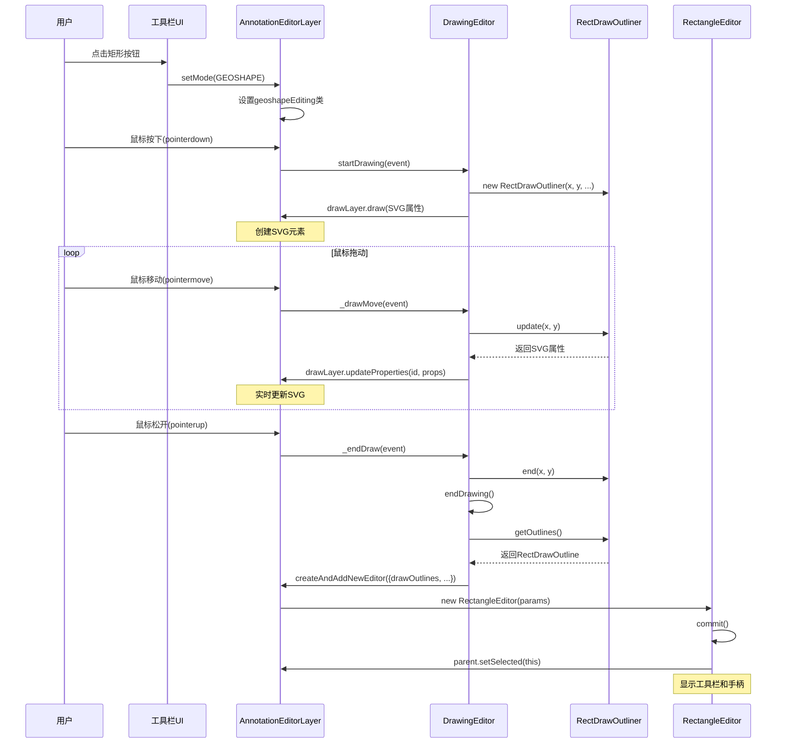

# 矩形工具完整实现指南

> 本文档详细记录矩形工具的完整实现过程，包括绘制功能和交互功能。供圆形工具和箭头工具实现时参考。

## 目录

1. [架构概览](#架构概览)
2. [核心类实现](#核心类实现)
3. [绘制流程详解](#绘制流程详解)
4. [交互功能实现](#交互功能实现)
5. [CSS样式配置](#css样式配置)
6. [参数管理系统](#参数管理系统)
7. [序列化与反序列化](#序列化与反序列化)
8. [实施检查清单](#实施检查清单)

---

## 架构概览

### 类继承关系

```
AnnotationEditor (基类)
    ↓ 继承
DrawingEditor (绘图编辑器基类)
    ↓ 继承
RectangleEditor (矩形编辑器)
```

### 核心组件

| 组件                 | 文件路径                                      | 职责                         |
| -------------------- | --------------------------------------------- | ---------------------------- |
| `RectangleEditor`    | `src/display/editor/rectangle.js`             | 矩形编辑器主类，管理生命周期 |
| `RectDrawingOptions` | `src/display/editor/rectangle.js`             | SVG属性管理                  |
| `RectDrawOutliner`   | `src/display/editor/drawers/rectangledraw.js` | 实时绘制管理                 |
| `RectDrawOutline`    | `src/display/editor/drawers/rectangledraw.js` | 轮廓数据存储                 |
| `DrawingEditor`      | `src/display/editor/draw.js`                  | 通用绘图逻辑                 |

---

## 核心类实现

### 1. RectangleEditor 类

**位置**: `src/display/editor/rectangle.js`

#### 1.1 类定义与配置

```javascript
class RectangleEditor extends DrawingEditor {
  static _type = "rectangle"; // 编辑器类型标识
  static _editorType = AnnotationEditorType.GEOSHAPE; // 注解类型（103）
  static _defaultDrawingOptions = null; // 默认绘图选项

  constructor(params) {
    super({ ...params, name: "rectangleEditor" });
    this._willKeepAspectRatio = false; // 不保持宽高比（允许8个手柄）
    this.defaultL10nId = "pdfjs-editor-rectangle-editor";
  }
}
```

**关键属性说明**：

- `_type = "rectangle"`: 用于CSS类名和DOM标识
- `_editorType = GEOSHAPE`: PDF注解类型，值为103
- `_willKeepAspectRatio = false`: 控制调整手柄数量
  - `false` → 8个手柄（4角 + 4边）
  - `true` → 4个手柄（仅4角）

#### 1.2 初始化方法

```javascript
static initialize(l10n, uiManager) {
  AnnotationEditor.initialize(l10n, uiManager);
  this._defaultDrawingOptions = new RectDrawingOptions(
    uiManager.viewParameters
  );
}
```

**调用时机**: 应用启动时由 `AnnotationEditorUIManager` 调用

#### 1.3 参数类型映射

```javascript
static get typesMap() {
  return shadow(
    this,
    "typesMap",
    new Map([
      [AnnotationEditorParamsType.RECTANGLE_THICKNESS, "stroke-width"],
      [AnnotationEditorParamsType.RECTANGLE_COLOR, "stroke"],
      [AnnotationEditorParamsType.RECTANGLE_OPACITY, "stroke-opacity"],
    ])
  );
}
```

**用途**: 将UI参数类型（51, 52, 53）映射到SVG属性名

#### 1.4 工具栏按钮配置

```javascript
get toolbarButtons() {
  this._colorPicker ||= new BasicColorPicker(this);
  return [["colorPicker", this._colorPicker]];
}
```

**说明**: 返回颜色选择器，工具栏还会自动添加批注和删除按钮

---

### 2. RectDrawingOptions 类

**职责**: 管理矩形的SVG绘图属性

```javascript
class RectDrawingOptions extends DrawingOptions {
  constructor(viewerParameters) {
    super();
    this._viewParameters = viewerParameters;

    super.updateProperties({
      fill: "none", // 无填充
      stroke: AnnotationEditor._defaultLineColor, // 边框颜色
      "stroke-opacity": 1, // 不透明度
      "stroke-width": 1, // 粗细
      "stroke-linecap": "square", // 方形端点
      "stroke-linejoin": "miter", // 斜接连接
      "stroke-miterlimit": 10, // 斜接限制
    });
  }

  updateSVGProperty(name, value) {
    if (name === "stroke-width") {
      value ??= this["stroke-width"];
      value *= this._viewParameters.realScale; // 缩放调整
    }
    super.updateSVGProperty(name, value);
  }

  clone() {
    const clone = new RectDrawingOptions(this._viewParameters);
    clone.updateAll(this);
    return clone;
  }
}
```

**关键方法**：

- `updateSVGProperty()`: 处理缩放时的属性更新
- `clone()`: 为每个编辑器实例创建独立副本

---

### 3. RectDrawOutliner 类

**职责**: 管理实时绘制过程（鼠标拖动时）

```javascript
class RectDrawOutliner {
  #startX; // 起始点X（归一化坐标[0,1]）
  #startY; // 起始点Y
  #endX; // 结束点X
  #endY; // 结束点Y
  #parentWidth; // 父容器宽度
  #parentHeight; // 父容器高度
  #rotation; // 旋转角度
  #thickness; // 线条粗细

  constructor(x, y, parentWidth, parentHeight, rotation, thickness) {
    this.#parentWidth = parentWidth;
    this.#parentHeight = parentHeight;
    this.#rotation = rotation;
    this.#thickness = thickness;

    // 归一化起始点到[0,1]范围
    [this.#startX, this.#startY] = this.#normalizePoint(x, y);
    [this.#endX, this.#endY] = [this.#startX, this.#startY];
  }
}
```

#### 3.1 关键方法

**坐标归一化**

```javascript
#normalizePoint(x, y) {
  return Outline._normalizePoint(
    x,
    y,
    this.#parentWidth,
    this.#parentHeight,
    this.#rotation
  );
}
```

**更新绘制**

```javascript
update(x, y) {
  [this.#endX, this.#endY] = this.#normalizePoint(x, y);

  return {
    rect: this.#getCurrentRectSVGProperties(),
  };
}
```

**矩形归一化**（处理负尺寸）

```javascript
#normalizeRect() {
  let x = this.#startX;
  let y = this.#startY;
  let width = this.#endX - this.#startX;
  let height = this.#endY - this.#startY;

  // 处理从右下往左上拖动的情况
  if (width < 0) {
    x = this.#endX;
    width = -width;
  }

  if (height < 0) {
    y = this.#endY;
    height = -height;
  }

  return [x, y, width, height];
}
```

**空矩形判断**

```javascript
isEmpty() {
  const threshold = 0.005; // ~5px in a 1000px viewport
  const width = Math.abs(this.#endX - this.#startX);
  const height = Math.abs(this.#endY - this.#startY);
  return width < threshold || height < threshold;
}
```

---

### 4. RectDrawOutline 类

**职责**: 存储完成的矩形轮廓数据

```javascript
class RectDrawOutline extends Outline {
  #bbox; // 边界框 [x, y, width, height]
  #currentRotation; // 当前旋转角度
  #innerMargin; // 内边距
  #rect; // 矩形数据 Float32Array
  #parentWidth; // 父容器宽度
  #parentHeight; // 父容器高度
  #parentScale; // 父容器缩放
  #rotation; // 初始旋转角度
  #thickness; // 线条粗细

  build(
    rect,
    parentWidth,
    parentHeight,
    parentScale,
    rotation,
    thickness,
    innerMargin
  ) {
    this.#rect = new Float32Array(rect);
    this.#parentWidth = parentWidth;
    this.#parentHeight = parentHeight;
    this.#parentScale = parentScale;
    this.#rotation = rotation;
    this.#thickness = thickness;
    this.#innerMargin = innerMargin ?? 0;

    this.#computeBbox(); // 计算边界框
  }
}
```

#### 4.1 边界框计算

```javascript
#computeBbox() {
  const [x, y, width, height] = this.#rect;
  const [marginX, marginY] = this.#getMarginComponents();

  this.#bbox = new Float32Array([
    MathClamp(x - marginX, 0, 1),
    MathClamp(y - marginY, 0, 1),
    Math.min(width + 2 * marginX, 1 - x + marginX),
    Math.min(height + 2 * marginY, 1 - y + marginY),
  ]);
}

#getMarginComponents(thickness = this.#thickness) {
  const margin = this.#innerMargin + (thickness / 2) * this.#parentScale;
  return this.#rotation % 180 === 0
    ? [margin / this.#parentWidth, margin / this.#parentHeight]
    : [margin / this.#parentHeight, margin / this.#parentWidth];
}
```

---

## 绘制流程详解

### 完整流程图



### 阶段详解

#### 阶段1：初始化绘制

**触发**: 用户在PDF页面上按下鼠标

**调用链**:

```
AnnotationEditorLayer.pointerdown
  → startDrawingSession
    → DrawingEditor.startDrawing
      → createDrawerInstance
        → new RectDrawOutliner(x, y, ...)
      → parent.drawLayer.draw(SVGProperties)
```

**关键代码**（DrawingEditor.startDrawing）:

```javascript
static startDrawing(parent, uiManager, isLTR, event) {
  // 获取绘制起点
  const { offsetX: x, offsetY: y } = event;
  const { parentWidth, parentHeight, rotation } = parent;

  // 创建绘制器实例
  DrawingEditor.#currentDraw = this.createDrawerInstance(
    x,
    y,
    parentWidth,
    parentHeight,
    rotation
  );

  // 获取默认绘图选项
  DrawingEditor.#currentDrawingOptions = this.getDefaultDrawingOptions();

  // 在SVG层绘制
  ({ id: this._currentDrawId } = parent.drawLayer.draw(
    this._mergeSVGProperties(
      DrawingEditor.#currentDrawingOptions.toSVGProperties(),
      DrawingEditor.#currentDraw.defaultSVGProperties
    )
  ));
}
```

#### 阶段2：实时更新

**触发**: 用户拖动鼠标

**调用链**:

```
window.pointermove
  → DrawingEditor._drawMove
    → RectDrawOutliner.update
      → parent.drawLayer.updateProperties
```

**关键代码**:

```javascript
static _drawMove(event) {
  const { offsetX: x, offsetY: y } = event;

  // 更新绘制器状态
  const updates = DrawingEditor.#currentDraw.add(x, y);

  // 更新SVG显示
  this._currentParent.drawLayer.updateProperties(
    this._currentDrawId,
    updates
  );
}
```

#### 阶段3：完成绘制

**触发**: 用户松开鼠标

**调用链**:

```
window.pointerup
  → DrawingEditor._endDraw
    → DrawingEditor.endDrawing
      → RectDrawOutliner.getOutlines
        → parent.createAndAddNewEditor
          → new RectangleEditor
            → commit
              → parent.setSelected(this)
```

**关键代码**（DrawingEditor.endDrawing）:

```javascript
static endDrawing(isAborted) {
  const parent = this._currentParent;

  if (!DrawingEditor.#currentDraw.isEmpty()) {
    const { pageDimensions, scale } = parent;

    // 创建编辑器实例
    const editor = parent.createAndAddNewEditor(
      { offsetX: 0, offsetY: 0 },
      false,
      {
        drawId: this._currentDrawId,
        drawOutlines: DrawingEditor.#currentDraw.getOutlines(
          pageWidth * scale,
          pageHeight * scale,
          scale,
          this._INNER_MARGIN
        ),
        drawingOptions: DrawingEditor.#currentDrawingOptions,
        mustBeCommitted: !isAborted,
      }
    );

    this._cleanup(true);
    return editor;
  }

  // 矩形太小，清理
  parent.drawLayer.remove(this._currentDrawId);
  this._cleanup(true);
  return null;
}
```

---

## 交互功能实现

### 1. 选中状态

**实现**: 继承自 `AnnotationEditor.select()`

```javascript
select() {
  this.isSelected = true;
  this.makeResizable();                    // 显示调整手柄
  this.div?.classList.add("selectedEditor"); // 添加蓝色边框

  if (!this._editToolbar) {
    this.addEditToolbar().then(() => {
      if (this.div?.classList.contains("selectedEditor")) {
        this._editToolbar?.show();          // 显示工具栏
      }
    });
    return;
  }

  this._editToolbar?.show();
}
```

**CSS效果**:

```css
.annotationEditorLayer :is(.rectangleEditor).selectedEditor {
  border: var(--focus-outline); /* 蓝色边框 */
  outline: var(--focus-outline-around);
}
```

### 2. 调整手柄

**创建**: `AnnotationEditor.makeResizable()` → `#createResizers()`

```javascript
#createResizers() {
  const resizers = (this.#resizersDiv = document.createElement("div"));
  resizers.classList.add("resizers");

  // 8个手柄位置
  const classes = this._willKeepAspectRatio
    ? ["topLeft", "topRight", "bottomRight", "bottomLeft"]  // 4个角
    : [
        "topLeft", "topMiddle", "topRight",
        "middleRight",
        "bottomRight", "bottomMiddle",
        "bottomLeft", "middleLeft",
      ];  // 8个（4角 + 4边）

  for (const name of classes) {
    const div = document.createElement("div");
    div.classList.add("resizer", name);
    div.setAttribute("data-resizer-name", name);
    div.tabIndex = -1;
    resizers.append(div);
  }

  this.div.prepend(resizers);
}
```

**CSS定位**:

```css
.annotationEditorLayer {
  :is(.rectangleEditor) {
    & > .resizers {
      position: absolute;
      inset: 0;
      z-index: 1;

      & > .resizer {
        width: var(--resizer-size);
        height: var(--resizer-size);
        background: var(--resizer-bg-color);
        border: var(--focus-outline-around);
        position: absolute;

        &.topLeft {
          top: var(--resizer-shift);
          left: var(--resizer-shift);
        }
        &.topMiddle {
          top: var(--resizer-shift);
          left: calc(50% + var(--resizer-shift));
        }
        &.topRight {
          top: var(--resizer-shift);
          right: var(--resizer-shift);
        }
        &.middleRight {
          top: calc(50% + var(--resizer-shift));
          right: var(--resizer-shift);
        }
        &.bottomRight {
          bottom: var(--resizer-shift);
          right: var(--resizer-shift);
        }
        &.bottomMiddle {
          bottom: var(--resizer-shift);
          left: calc(50% + var(--resizer-shift));
        }
        &.bottomLeft {
          bottom: var(--resizer-shift);
          left: var(--resizer-shift);
        }
        &.middleLeft {
          top: calc(50% + var(--resizer-shift));
          left: var(--resizer-shift);
        }
      }
    }
  }
}
```

### 3. 工具栏

**创建**: `AnnotationEditor.addEditToolbar()`

```javascript
async addEditToolbar() {
  if (this._editToolbar || this.#isInEditMode) {
    return this._editToolbar;
  }

  this._editToolbar = new EditorToolbar(this);
  this.div.append(this._editToolbar.render());

  // 添加子类定义的按钮
  const { toolbarButtons } = this;
  if (toolbarButtons) {
    for (const [name, tool] of toolbarButtons) {
      await this._editToolbar.addButton(name, tool);
    }
  }

  // 添加批注按钮
  if (!this.hasComment) {
    this._editToolbar.addButton("comment", this.addCommentButton());
  }

  // 添加删除按钮
  this._editToolbar.addButton("delete");

  return this._editToolbar;
}
```

**工具栏渲染**（EditorToolbar.render）:

```javascript
render() {
  const editToolbar = document.createElement("div");
  editToolbar.classList.add("editToolbar", "hidden");
  editToolbar.setAttribute("role", "toolbar");

  const buttons = document.createElement("div");
  buttons.className = "buttons";
  editToolbar.append(buttons);

  // 定位（如果toolbarPosition返回null，使用CSS默认定位）
  const position = this.#editor.toolbarPosition;
  if (position) {
    const { style } = editToolbar;
    const x = this.#editor._uiManager.direction === "ltr"
      ? 1 - position[0]
      : position[0];
    style.insetInlineEnd = `${100 * x}%`;
    style.top = `calc(${100 * position[1]}% + var(--editor-toolbar-vert-offset))`;
  }

  return editToolbar;
}
```

**按钮添加**:

```javascript
// 颜色选择器
addColorPicker(colorPicker) {
  const button = colorPicker.renderButton();  // <input type="color">
  this.#addListenersToElement(button);
  this.#buttons.append(button, this.#divider);
}

// 删除按钮
addDeleteButton() {
  const button = document.createElement("button");
  button.classList.add("basic", "deleteButton");
  button.setAttribute("data-l10n-id", EditorToolbar.#l10nRemove[editorType]);
  button.addEventListener("click", () => {
    this.#editor._uiManager.delete();
  });
  this.#buttons.append(button);
}
```

---

## CSS样式配置

### 关键CSS选择器

**文件**: `web/annotation_editor_layer_builder.css`

#### 1. 编辑器基础样式

```css
.annotationEditorLayer
  :is(
    .freeTextEditor,
    .inkEditor,
    .stampEditor,
    .signatureEditor,
    .rectangleEditor
  ) {
  position: absolute;
  background: transparent;
  z-index: 1;
  transform-origin: 0 0;
  cursor: auto;
  max-width: 100%;
  max-height: 100%;
  border: var(--unfocus-outline);

  &.draggable.selectedEditor {
    cursor: move;
  }

  &.selectedEditor {
    border: var(--focus-outline);
    outline: var(--focus-outline-around);
  }

  &:hover:not(.selectedEditor) {
    border: var(--hover-outline);
    outline: var(--hover-outline-around);
  }
}
```

#### 2. 工具栏样式

```css
.annotationEditorLayer
  :is(
    .freeTextEditor,
    .inkEditor,
    .stampEditor,
    .highlightEditor,
    .signatureEditor,
    .rectangleEditor  /* ⚠️ 必须包含！ */
  ),
.textLayer {
  .editToolbar {
    /* CSS变量定义 */
    --editor-toolbar-delete-image: url(images/editor-toolbar-delete.svg);
    --editor-toolbar-bg-color: light-dark(#f0f0f4, #2b2a33);
    --editor-toolbar-fg-color: light-dark(#2e2e56, #fbfbfe);
    --editor-toolbar-border-color: #8f8f9d;
    --editor-toolbar-height: 28px;
    --editor-toolbar-padding: 2px;

    /* 布局和定位 */
    display: flex;
    width: fit-content;
    height: var(--editor-toolbar-height);
    flex-direction: column;
    justify-content: center;
    align-items: center;
    cursor: default;
    pointer-events: auto;
    box-sizing: content-box;
    padding: var(--editor-toolbar-padding);

    /* 定位到编辑器右下角 */
    position: absolute;
    inset-inline-end: 0;
    inset-block-start: calc(100% + var(--editor-toolbar-vert-offset));

    /* 外观 */
    border-radius: 6px;
    background-color: var(--editor-toolbar-bg-color);
    border: 1px solid var(--editor-toolbar-border-color);
    box-shadow: var(--editor-toolbar-shadow);

    &.hidden {
      display: none;
    }

    /* 按钮容器 */
    .buttons {
      display: flex;
      justify-content: center;
      align-items: center;
      gap: 0;
      height: 100%;

      /* 按钮基础样式 */
      > :not(.divider) {
        border: none;
        background-color: transparent;
        cursor: pointer;

        &:hover {
          border-radius: 2px;
          background-color: var(--editor-toolbar-hover-bg-color);
        }
      }

      /* 删除按钮图标（使用CSS mask）*/
      .basic.deleteButton::before {
        content: "";
        mask-image: var(--editor-toolbar-delete-image);
        mask-repeat: no-repeat;
        mask-position: center;
        display: inline-block;
        background-color: var(--editor-toolbar-fg-color);
        width: 100%;
        height: 100%;
      }

      /* 分隔线 */
      .divider {
        width: 0;
        height: calc(
          2 * var(--editor-toolbar-padding) + var(--editor-toolbar-height)
        );
        border-left: 1px solid var(--editor-toolbar-border-color);
        display: inline-block;
        margin-inline: 2px;
      }
    }
  }
}
```

#### 3. 调整手柄样式

```css
.annotationEditorLayer {
  :is(
    .freeTextEditor,
    .inkEditor,
    .stampEditor,
    .signatureEditor,
    .rectangleEditor
  ) {
    & > .resizers {
      position: absolute;
      inset: 0;
      z-index: 1;

      &.hidden {
        display: none;
      }

      & > .resizer {
        width: var(--resizer-size);
        height: var(--resizer-size);
        background: content-box var(--resizer-bg-color);
        border: var(--focus-outline-around);
        border-radius: 2px;
        position: absolute;

        /* 8个手柄的具体位置 */
        &.topLeft {
          top: var(--resizer-shift);
          left: var(--resizer-shift);
        }
        &.topMiddle {
          top: var(--resizer-shift);
          left: calc(50% + var(--resizer-shift));
        }
        &.topRight {
          top: var(--resizer-shift);
          right: var(--resizer-shift);
        }
        &.middleRight {
          top: calc(50% + var(--resizer-shift));
          right: var(--resizer-shift);
        }
        &.bottomRight {
          bottom: var(--resizer-shift);
          right: var(--resizer-shift);
        }
        &.bottomMiddle {
          bottom: var(--resizer-shift);
          left: calc(50% + var(--resizer-shift));
        }
        &.bottomLeft {
          bottom: var(--resizer-shift);
          left: var(--resizer-shift);
        }
        &.middleLeft {
          top: calc(50% + var(--resizer-shift));
          left: var(--resizer-shift);
        }
      }
    }
  }
}
```

#### 4. 绘制模式光标

```css
.annotationEditorLayer.geoshapeEditing {
  cursor: var(--editorGeoShape-rect-cursor);
}

.annotationEditorLayer.geoshapeRectEditing {
  cursor: var(--editorGeoShape-rect-cursor);
}
```

---

## 参数管理系统

### 参数类型定义

**文件**: `src/shared/util.js`

```javascript
const AnnotationEditorParamsType = {
  // ... 其他参数类型
  RECTANGLE_COLOR: 51,
  RECTANGLE_THICKNESS: 52,
  RECTANGLE_OPACITY: 53,
};
```

### 参数面板配置

**HTML**: `web/viewer.html`（几何工具面板）

```html
<div
  id="editorGeoShapeParamsToolbar"
  class="editorParamsToolbar hidden doorHangerRight"
>
  <div class="editorParamsToolbarContainer">
    <div class="editorParamsSetter">
      <label
        for="editorGeoShapeColor"
        class="editorParamsLabel"
        data-l10n-id="pdfjs-editor-geoshape-color-label"
        >Color</label
      >
      <input
        type="color"
        id="editorGeoShapeColor"
        class="editorParamsColor"
        tabindex="110"
      />
    </div>
    <div class="editorParamsSetter">
      <label
        for="editorGeoShapeThickness"
        class="editorParamsLabel"
        data-l10n-id="pdfjs-editor-geoshape-thickness-label"
        >Thickness</label
      >
      <input
        type="range"
        id="editorGeoShapeThickness"
        class="editorParamsSlider"
        value="1"
        min="1"
        max="12"
        step="1"
        tabindex="111"
      />
    </div>
    <div class="editorParamsSetter">
      <label
        for="editorGeoShapeOpacity"
        class="editorParamsLabel"
        data-l10n-id="pdfjs-editor-geoshape-opacity-label"
        >Opacity</label
      >
      <input
        type="range"
        id="editorGeoShapeOpacity"
        class="editorParamsSlider"
        value="100"
        min="1"
        max="100"
        step="1"
        tabindex="112"
      />
    </div>
  </div>
</div>
```

### 参数事件流

```
UI输入变化
  ↓
AnnotationEditorParams.#dispatchEvent
  ↓ 派发 "annotationeditorparamschanged"
AnnotationEditorUIManager.#addEditorParamsListener
  ↓
AnnotationEditorUIManager.updateParams
  ↓
RectangleEditor.updateDefaultParams (静态方法，更新默认值)
或
RectangleEditor.updateParams (实例方法，更新当前编辑器)
  ↓
DrawLayer.updateProperties
  ↓
SVG元素更新
```

**代码示例**（AnnotationEditorParams）:

```javascript
#dispatchEvent(typeStr, value) {
  this.eventBus.dispatch("annotationeditorparamschanged", {
    source: this,
    type: AnnotationEditorParamsType[typeStr],
    value,
  });
}

// 监听颜色变化
this.#bindListeners({
  editorGeoShapeColor: (event, value) => {
    this.#dispatchEvent("RECTANGLE_COLOR", value);
  },
  editorGeoShapeThickness: (event, value) => {
    this.#dispatchEvent("RECTANGLE_THICKNESS", value);
  },
  editorGeoShapeOpacity: (event, value) => {
    this.#dispatchEvent("RECTANGLE_OPACITY", value / 100);
  },
});
```

**参数更新**（DrawingEditor）:

```javascript
static updateDefaultParams(type, value) {
  if (!this._defaultDrawingOptions) {
    return;
  }

  const propertyName = this.typesMap.get(type);
  if (!propertyName) {
    return;
  }

  this._defaultDrawingOptions.updateProperty(propertyName, value);
}

updateParams(type, value) {
  const propertyName = this.constructor.typesMap.get(type);
  if (!propertyName) {
    return;
  }

  this._updateProperty(propertyName, value);
}

_updateProperty(name, value) {
  const saved = this._drawingOptions[name];
  this._drawingOptions.updateProperty(name, value);

  const addToUndo = () => {
    this.parent.addCommands({
      cmd: () => {
        this._updateProperty(name, value);
      },
      undo: () => {
        this._updateProperty(name, saved);
      },
      mustExec: false,
      type: AnnotationEditorParamsType.GEOSHAPE_PROPERTY,
    });
  };

  // 更新SVG显示
  const updates = this.drawLayer.updateProperties(
    this._drawId,
    this._drawingOptions.toSVGProperties()
  );

  addToUndo();
}
```

---

## 序列化与反序列化

### 序列化（保存到PDF）

```javascript
serialize(isForCopying = false) {
  if (this.isEmpty()) {
    return null;
  }

  if (this.deleted) {
    return this.serializeDeleted();
  }

  // 获取矩形坐标数据
  const { rect, rectData } = this.serializeDraw(isForCopying);

  // 获取绘图属性
  const {
    _drawingOptions: {
      stroke,
      "stroke-opacity": opacity,
      "stroke-width": thickness,
    },
  } = this;

  // 序列化数据
  const serialized = Object.assign(super.serialize(isForCopying), {
    color: AnnotationEditor._colorManager.convert(stroke),
    opacity,
    thickness,
    rect,        // PDF坐标系的矩形 [x1, y1, x2, y2]
    rectData,    // 归一化坐标 [x, y, width, height]
  });

  this.addComment(serialized);

  if (isForCopying) {
    serialized.isCopy = true;
    return serialized;
  }

  // 检查是否有变化
  if (this.annotationElementId && !this.#hasElementChanged(serialized)) {
    return null;
  }

  serialized.id = this.annotationElementId;
  return serialized;
}

serializeDraw(isForCopying) {
  if (isForCopying) {
    return {
      rect: null,
      rectData: this.#drawOutlines.serialize([0, 0, 1, 1], true).rectData,
    };
  }

  const [pageWidth, pageHeight] = this.pageDimensions;
  return this.#drawOutlines.serialize(
    this.#getPageRotationAndProps(pageWidth, pageHeight),
    false
  );
}
```

**序列化输出示例**:

```javascript
{
  annotationType: 103,  // AnnotationEditorType.GEOSHAPE
  id: "pdfjs_internal_editor_0",
  color: [255, 0, 0],   // RGB格式
  opacity: 1,
  thickness: 1,
  rect: [100, 200, 300, 400],  // PDF坐标系
  rectData: Float32Array[0.1, 0.2, 0.2, 0.2],  // 归一化坐标
  pageIndex: 0,
  rotation: 0,
  comment: null,
}
```

### 反序列化（从PDF加载）

```javascript
static async deserialize(data, parent, uiManager) {
  let initialData = null;

  if (data instanceof SquareAnnotationElement) {
    // 从PDF注解元素转换
    const {
      data: {
        rect,
        rotation,
        id,
        color,
        opacity,
        borderStyle: { rawWidth: thickness },
        popupRef,
        richText,
        contentsObj,
        creationDate,
        modificationDate,
      },
      parent: {
        page: { pageNumber },
      },
    } = data;

    // 转换rect到rectData（归一化坐标）
    const [x1, y1, x2, y2] = rect;
    const rectData = new Float32Array([
      Math.min(x1, x2),
      Math.min(y1, y2),
      Math.abs(x2 - x1),
      Math.abs(y2 - y1),
    ]);

    initialData = data = {
      annotationType: AnnotationEditorType.GEOSHAPE,
      color: Array.from(color),
      thickness,
      opacity,
      rect: rect.slice(0),
      rectData,
      pageIndex: pageNumber - 1,
      rotation,
      annotationElementId: id,
      id,
      deleted: false,
      popupRef,
      richText,
      comment: contentsObj?.str || null,
      creationDate,
      modificationDate,
    };
  }

  const editor = await super.deserialize(data, parent, uiManager);
  editor._initialData = initialData;

  if (data.comment) {
    editor.setCommentData(data);
  }

  return editor;
}
```

---

## 实施检查清单

### JavaScript代码

- [ ] 创建编辑器类，继承自 `DrawingEditor`
- [ ] 定义 `_type` 和 `_editorType`
- [ ] 实现 `DrawingOptions` 子类
- [ ] 实现 `Outliner` 类（实时绘制）
- [ ] 实现 `Outline` 类（轮廓数据）
- [ ] 定义 `typesMap`（参数映射）
- [ ] 实现 `toolbarButtons` getter
- [ ] 实现 `serialize` 和 `deserialize`
- [ ] 实现 `createDrawerInstance`
- [ ] 实现 `getDefaultDrawingOptions`

### CSS样式

- [ ] 将编辑器类名添加到基础样式选择器
- [ ] 将编辑器类名添加到工具栏样式选择器 ⚠️ **重要**
- [ ] 将编辑器类名添加到调整手柄样式选择器 ⚠️ **重要**
- [ ] 定义绘制模式光标样式
- [ ] 测试选中、悬停、禁用等状态

### 参数系统

- [ ] 在 `util.js` 中定义参数类型常量
- [ ] 在 `viewer.html` 中添加参数面板HTML
- [ ] 在 `annotation_editor_params.js` 中绑定事件监听
- [ ] 实现 `updateDefaultParams` 静态方法
- [ ] 实现 `updateParams` 实例方法

### 本地化

- [ ] 颜色选择器l10n键（`BasicColorPicker.#l10nColor`）
- [ ] 删除按钮l10n键（`EditorToolbar.#l10nRemove`）
- [ ] 编辑器标签l10n键（`defaultL10nId`）
- [ ] 在 `l10n/en-US/viewer.ftl` 添加英文翻译
- [ ] 在 `l10n/zh-CN/viewer.ftl` 添加中文翻译
- [ ] （可选）在其他语言文件中添加翻译

### 测试验证

- [ ] 绘制工具是否正常（拖动创建）
- [ ] 矩形是否可以选中
- [ ] 蓝色边框是否显示
- [ ] 8个调整手柄是否显示且可用
- [ ] 工具栏是否在正确位置（右下角外侧）
- [ ] 工具栏是否包含所有按钮（颜色、批注、删除）
- [ ] 颜色选择器是否工作
- [ ] 参数面板是否影响新绘制的图形
- [ ] 拖动移动是否正常
- [ ] 调整大小是否正常
- [ ] 旋转是否正常
- [ ] 删除是否正常
- [ ] 序列化和反序列化是否正常
- [ ] 撤销/重做是否正常

---

## 关键要点总结

### 1. 继承关系很重要

```
AnnotationEditor (提供基础交互)
  ↓
DrawingEditor (提供绘图机制)
  ↓
RectangleEditor (特定形状实现)
```

**不要重复实现**已在基类中存在的功能（选中、拖动、工具栏等）。

### 2. CSS选择器必须完整

矩形工具失效的主要原因就是**CSS选择器遗漏**。必须在以下3个地方添加编辑器类名：

1. **基础编辑器样式**（定位、边框等）
2. **工具栏样式作用域** ⚠️ **最关键**
3. **调整手柄样式作用域** ⚠️ **最关键**

### 3. 两个Outliner类的职责

- **`Outliner`**: 管理实时绘制过程，处理鼠标拖动
- **`Outline`**: 存储完成的轮廓数据，处理变换和序列化

### 4. 坐标系统理解

PDF.js使用多个坐标系：

- **Canvas坐标**: 像素坐标（offsetX, offsetY）
- **归一化坐标**: [0, 1]范围（用于存储）
- **PDF坐标**: PDF页面坐标（用于序列化）
- **SVG坐标**: 10000x10000虚拟坐标

### 5. 参数管理的两条链路

- **绘制前预设**: 参数面板 → updateDefaultParams → 影响下次绘制
- **绘制后修改**: 工具栏按钮 → updateParams → 影响当前编辑器

### 6. commit()的特殊性

`DrawingEditor.commit()` **不应该** 调用 `disableEditing()`。

- **InkEditor需要**: 多次绘制完成后禁用
- **RectangleEditor不需要**: 单次绘制后保持可交互

解决方案：

- 在 `DrawingEditor.commit()` 中移除 `disableEditing()`
- 在 `InkEditor.commit()` 中单独添加

### 7. 本地化必须完整

需要添加本地化的地方：

- 颜色选择器：`BasicColorPicker.#l10nColor`
- 删除按钮：`EditorToolbar.#l10nRemove`
- 编辑器标签：`defaultL10nId`

缺少本地化会导致：

- `data-l10n-id="undefined"`
- 工具提示不显示
- 按钮图标不显示（CSS mask需要正确的选择器）

---

## 圆形和箭头工具实施建议

### 圆形工具（Circle/Ellipse）

**差异点**:

1. **Outliner实现**: 使用中心点+半径或椭圆方程
2. **SVG元素**: 使用 `<circle>` 或 `<ellipse>` 而非 `<rect>`
3. **宽高比**: 可能需要 `_willKeepAspectRatio = true`（正圆）
4. **参数类型**: 定义新的常量（CIRCLE_COLOR等）

**复用**:

- 基本架构完全相同
- CSS选择器模式相同
- 工具栏和手柄机制相同

### 箭头工具（Arrow）

**差异点**:

1. **Outliner实现**: 需要计算箭头方向、箭头头部形状
2. **SVG元素**: 使用 `<line>` + `<path>`（箭头头）
3. **额外参数**: 箭头头部大小、样式
4. **宽高比**: 应该 `_willKeepAspectRatio = false`（允许旋转）

**复用**:

- DrawingEditor的绘图流程
- 参数管理系统
- 序列化框架

### 共同的实施步骤

1. **规划阶段**
   - 确定SVG元素类型
   - 设计参数类型常量
   - 规划Outliner的坐标计算逻辑

2. **核心实现**
   - 复制RectangleEditor作为起点
   - 实现特定的Outliner和Outline类
   - 调整DrawingOptions默认值

3. **集成配置**
   - 添加到CSS选择器（3个位置）
   - 添加参数面板HTML
   - 添加本地化字符串

4. **测试验证**
   - 按照检查清单逐项测试
   - 特别关注CSS作用域

---

**文档版本**: 1.0  
**创建日期**: 2025-12-17  
**作者**: AI Assistant  
**适用于**: PDF.js 矩形/圆形/箭头工具实现
